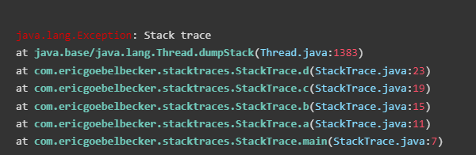

# javaStack.js
[](https://www.npmjs.com/package/jsstack.js)


A simple and easy library for highlighting JavaScript stack traces

#### Demo


#### Initialization
```javascript
javaStack('.stacktrace');
```

#### Default values for classes and prettyprint
```javascript
javaStack('.stacktrace', {
	method: 'st-methodName',
	file: 'st-fileName',
	line: 'st-lineNumber',
	exception: 'st-exception',
	prettyprint: true,
});
```

#### Ready to go css
```css
pre {padding: 20px 10px;}
pre, code {background-color: #333;color: #ffffff;}
.st-methodName {color: #70c9ba;font-weight: bolder;}
.st-lineNumber {color: #ff4f68;}
.st-fileName {color: #85dbff;}
.st-intro {color: #0044dd;}
.st-exception {color: #e40000;}
```
